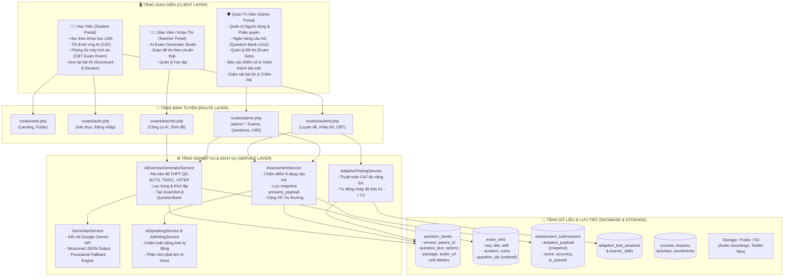
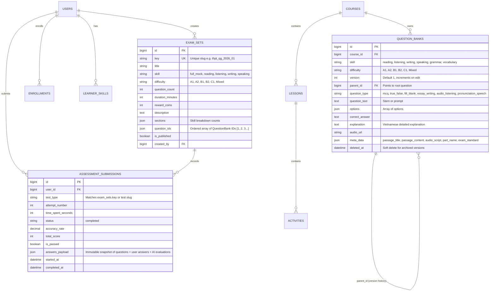

# ESL LEARNING & ASSESSMENT MANAGEMENT SYSTEM (ESL LMS & CBT)

> **Tài liệu kiến trúc tổng thể, sơ đồ chức năng và cấu trúc thư mục của nền tảng học tiếng Anh trực tuyến và khảo thí chuẩn hóa (ESL Education, CBT Online Exams, CAT Adaptive Testing & AI Question Generator).**

---

## 📑 MỤC LỤC

1. [Sơ Đồ Kiến Trúc Tổng Thể Hệ Thống](#1-sơ-đồ-kiến-trúc-tổng-thể-hệ-thống)
2. [Bản Đồ Phân Hệ Chức Năng (Feature Matrix)](#2-bản-đồ-phân-hệ-chức-năng-feature-matrix)
3. [Sơ Đồ Thực Thể CSDL & Luồng Dữ Liệu (ERD & Data Flow)](#3-sơ-đồ-thực-thể-csdl--luồng-dữ-liệu-erd--data-flow)
4. [Cấu Trúc Thư Mục Toàn Dự Án](#4-cấu-trúc-thư-mục-toàn-dự-án)
5. [Bản Đồ Định Tuyến (Route Map)](#5-bản-đồ-định-tuyến-route-map)
6. [Các Cơ Chế & Quy Chuẩn Nghiệp Vụ Quan Trọng](#6-các-cơ-chế--quy-chuẩn-nghiệp-vụ-quan-trọng)

---

## 1. SƠ ĐỒ KIẾN TRÚC TỔNG THỂ HỆ THỐNG



---

## 2. BẢN ĐỒ PHÂN HỆ CHỨC NĂNG (FEATURE MATRIX)

### 2.1. Phân Hệ AI Exam Generator Studio (`/teacher/ai-generator`)
- **Chuẩn đề thi tích hợp**:
  - `thpt_qg`: Đề thi Tốt nghiệp THPT môn Tiếng Anh (50 câu ma trận chuẩn Bộ GD&ĐT: Phát âm, Trọng âm, Ngữ pháp, Từ vựng, Đồng nghĩa, Trái nghĩa, Giao tiếp, Đọc điền, Đọc hiểu văn bản 1 & 2, Tìm lỗi sai, Viết lại câu).
  - `ielts`: Academic & General (Reading Passages với True/False/Not Given, MCQ; Listening Transcripts; Writing Task 1-2; Speaking Cue Cards).
  - `toeic`: Business English (Part 5 Incomplete Sentences, Part 6 Text Completion, Part 7 Reading Passages thương mại).
  - `vstep`: Khung năng lực 6 bậc Việt Nam (Bài đọc học thuật, Viết thư 120 từ, Luận 250 từ, Thảo luận giải pháp nói).
  - `cefr`: Khung Châu Âu A1, A2, B1, B2, C1.
- **Tính năng xuất bản kép**:
  - **Lưu thành Đề Thi Trực Tiếp (`saveExamSet`)**: Tạo bản ghi `ExamSet` gắn mảng `question_ids` theo đúng thứ tự 1..N, xuất bản phòng thi CBT tại `/practice/exam/{key}`.
  - **Lưu vào Ngân hàng câu hỏi (`saveToQuestionBank`)**: Lưu vào `question_banks` kèm đầy đủ `meta_data` (`passage_title`, `passage_content`, `audio_script`, `part_name`, `exam_standard`).
- **Khử trùng lặp tự động**: Thuật toán `normalizeText` so khớp batch và 1000 câu gần nhất trong database.

### 2.2. Phân Hệ Phòng Thi Máy Tính Ảo CBT (`/practice/exam/{testKey}`)
- Màn hình giao diện CBT chuẩn quốc tế (chia 2 cột với Reading Passage cuộn độc lập bên trái, câu hỏi trắc nghiệm bên phải).
- Đồng hồ đếm ngược thời gian thực (Countdown Timer), lưu nháp tự động (`localStorage`).
- Audio Player cho Listening, AI Voice Recording Studio ghi âm trực tiếp cho kỹ năng Nói.
- Text Editor đếm từ trực tiếp cho kỹ năng Viết.
- Bảng câu hỏi chuyển nhanh (Question Palette) gắn cờ (`Flag`), trạng thái Đã trả lời / Chưa trả lời.
- Nộp bài thi và hiển thị bảng điểm chi tiết (`/practice/exam/{testKey}/submit` -> Scorecard).
- Xem lại lịch sử các lần thi (`reviewAttempt` tại `/practice/exam/{testKey}/attempts/{submissionId}`).

### 2.3. Phân Hệ Thi Thích Ứng AI CAT (`/practice/adaptive`)
- Đánh giá năng lực 4 kỹ năng máy tính thích ứng (Computerized Adaptive Testing).
- Tự động tăng/giảm độ khó (`A1 -> A2 -> B1 -> B2 -> C1`) sau mỗi câu trả lời đúng/sai.
- Cập nhật ma trận năng lực `learner_skills`.

### 2.4. Phân Hệ Quản Trị Ngân Hàng Câu Hỏi & Versioning (`/admin/questions`)
- Quản lý câu hỏi đơn lẻ (Single Questions) và Cụm bài đọc/nghe (Testlets).
- **Hệ thống Question Versioning (`v1, v2, v3...`)**:
  - Khi chỉnh sửa câu hỏi: Nhân bản bản ghi hiện tại thành bản ghi lưu trữ lịch sử (`parent_id = $id`, `deleted_at = now()`), bản ghi chính tăng số phiên bản lên `v(n+1)`.
  - Mọi bài thi học viên đã nộp trong quá khứ lưu snapshot bất biến trong `answers_payload`, đảm bảo điểm số và nội dung thi cũ không bao giờ bị xê dịch.
  - API lịch sử phiên bản: `GET /admin/questions/{id}/versions`.

### 2.5. Phân Hệ Khảo Thí & Đề Thi (`/admin/exams`)
- Quản lý danh sách đề thi `ExamSet` (Full Mock 4 kỹ năng hoặc từng kỹ năng đơn lẻ).
- Tạo đề thi thủ công hoặc liên kết với các ID trong ngân hàng câu hỏi.
- Bật/tắt xuất bản (`is_published`), phân quyền và thống kê lượt thi (`submissions_count`).

### 2.6. Phân Hệ Tùy Biến Giao Diện & Bảng Màu (Theme & Color Customization)
- **3 Chế độ hiển thị (Appearance Modes)**: Tối (`dark`), Sáng (`light`), Hệ thống (`auto` tự phát hiện theo thiết bị).
- **7 Bộ bảng màu thương hiệu (Accent Color Palettes)**:
  1. `blue`: Ocean Blue (`#3b82f6`)
  2. `indigo`: Electric Indigo (`#6366f1` - Mặc định)
  3. `purple`: Royal Violet (`#8b5cf6`)
  4. `emerald`: Emerald Mint (`#10b981`)
  5. `amber`: Sunset Amber (`#f59e0b`)
  6. `rose`: Crimson Rose (`#f43f5e`)
  7. `cyan`: Cyber Cyan (`#06b6d4`)
- **Hiệu ứng Neon Glow**: Bật/tắt viền sáng đa tầng (Ambient Lighting) quanh các nút chính và trạng thái kích hoạt.
- **Thành phần tương tác Client (`<x-theme-switcher />`)**:
  - Gắn tại Header Học viên & Admin Portal, lưu trạng thái tức thì vào `localStorage` (`esl_theme_mode`, `esl_theme_accent`, `esl_theme_glow`).
  - Script Anti-FOUC (Flash of Unstyled Content) trong `<head>` thực thi đồng bộ trước khi render DOM.
- **Cấu hình Mặc định Toàn Hệ thống (`/admin/settings`)**:
  - Quản trị viên tùy chỉnh giao diện và màu sắc mặc định cho toàn bộ người dùng mới, lưu vào file `.env` (`THEME_DEFAULT_MODE`, `THEME_DEFAULT_ACCENT`, `THEME_ENABLE_GLOW`).

### 2.7. Phân Hệ Báo Cáo & Ma Trận Điểm Số, Hoàn Thành LMS (`/admin/reports`)
- **Báo cáo Điểm số Từng Hoạt Động & Bảng Điểm Ma Trận (`/admin/reports/activity-grades`)**:
  - **Bảng điểm Ma trận Học viên x Hoạt động (Learner x Activity Grade Matrix)**:
    - *Cột cố định (Sticky)*: Học viên (Avatar, Tên, Email), Điểm trung bình khóa học (GPA), Xếp loại học lực (`A-F`), tiến độ hoàn thành (`X/Y HĐ`).
    - *Trục ngang*: Toàn bộ hoạt động trong khóa học phân theo bài học (Quiz, Assignment, AI Speaking, Flashcard, Video...), hiển thị mức điểm sàn yêu cầu.
    - *Ô điểm số (Color-coded Cells)*: Điểm số màu sắc phân cấp trực quan (&ge;80đ: Xanh lá, 65-79đ: Xanh dương, 50-64đ: Vàng cam, &lt;50đ: Đỏ chưa đạt sàn, `-`: Chưa làm) kèm Tooltip chi tiết thời gian làm bài và ngày nộp.
    - *Hàng tổng kết chân trang (Class Column Averages)*: Tự động tính **Điểm trung bình cả lớp** cho từng hoạt động và **Tỷ lệ % học viên đạt điểm sàn**, giúp giáo viên phát hiện ngay hoạt động nào học sinh làm bài kém.
  - **3 Chế độ xem linh hoạt (Tabs)**:
    1. *🎯 Ma trận Điểm số*: Bảng ma trận tổng thể học viên x hoạt động (chế độ mặc định).
    2. *📋 Danh sách Chi tiết Lượt nộp*: Bảng log phân trang với bộ lọc đa chiều (Khóa học, Bài học, Loại hoạt động, Kết quả Đạt/Chưa đạt, Sắp xếp và Tìm kiếm).
    3. *📊 Thống kê & Xếp loại*: Biểu đồ histogram phân bố điểm số A-F và Top hoạt động có số lượt làm nhiều nhất.
  - **Tìm kiếm tức thì (Real-time Filter)**: Lọc học viên trong ma trận tức thì theo tên/email mà không cần tải lại trang.
  - **Xuất CSV Bảng điểm Ma trận**: Xuất trực tiếp bảng ma trận điểm với các cột hoạt động ra file Excel/CSV chuẩn UTF-8 BOM không lỗi font tiếng Việt.
- **Báo cáo Hoàn Thành Từng Hoạt Động Theo Khóa Học (`/admin/reports/completions`)**:
  - **Bộ chọn Khóa học Trọng tâm (Course Selector)**: Phân tích chuyên sâu tỷ lệ hoàn thành theo khóa học được chọn.
  - **Chỉ số KPI Khóa học & Cảnh báo Điểm nghẽn (Bottlenecks)**:
    - Tổng học viên ghi danh, tổng hoạt động, tỷ lệ hoàn thành trung bình khóa học, số học viên hoàn thành 100%.
    - **Tự động phát hiện Điểm rơi rớt (Bottleneck Activity)**: Cảnh báo hoạt động có tỷ lệ hoàn thành thấp nhất trong khóa học.
  - **3 Chế độ xem phân tích**:
    1. *📊 Thống kê theo Hoạt động*: Nhóm theo bài học, số HV hoàn thành / tổng ghi danh, thanh tiến độ % màu sắc (&ge;80%: Xanh lá, 50-79%: Vàng, &lt;50%: Đỏ cảnh báo "Cần hỗ trợ"), điểm TB, thời gian TB.
    2. *🎯 Ma trận Hoàn thành*: Bảng ma trận học viên x hoạt động dạng lưới với dấu tích xanh `✓` và gạch xám `-`.
    3. *📋 Nhật ký Chi tiết*: Bảng log hoàn thành chi tiết kèm bộ lọc và phân trang.
  - **Xuất CSV Báo cáo Hoàn thành theo khóa học**: Tích hợp xuất file CSV chuẩn UTF-8 BOM.

### 2.8. Phân Hệ Thông Báo & Nhắn Tin Tức Thời (Notifications & Direct Messaging)
- **Trung Tâm Thông Báo (Notification Center)**:
  - Thông báo đa kênh phân loại theo ngữ cảnh: Khóa học (`course`), Bài tập (`assignment`), Đề thi (`exam`), Điểm số (`grade`), Tin nhắn (`message`), Danh hiệu (`badge`), Thông báo chung (`announcement`).
  - Dropdown chuông thông báo trực tiếp trên Header với badge đếm số lượng chưa đọc thời gian thực.
  - Trang trung tâm thông báo toàn diện (`/notifications`) hỗ trợ lọc Chưa đọc / Tất cả, Đọc tất cả, Xóa toàn bộ.
- **Phân Hệ Nhắn Tin Trực Tiếp (Messenger / Direct Chat)**:
  - Hỗ trợ nhắn tin 1-1 riêng tư và trò chuyện nhóm giữa học viên, giáo viên và quản trị viên (`/messages`).
  - Giao diện hai cột hiện đại: danh sách hội thoại bên trái (avatar, trạng thái hoạt động, tin nhắn mới nhất, badge chưa đọc) và cửa sổ chat bên phải.
  - Tự động kết nối hội thoại sẵn có hoặc tạo mới, tìm kiếm người dùng nhanh theo tên/email.
  - Tích hợp thông báo tức thời đến người nhận khi có tin nhắn mới.

---

## 3. SƠ ĐỒ THỰC THỂ CSDL & LUỒNG DỮ LIỆU (ERD & DATA FLOW)



---

## 4. CẤU TRÚC THƯ MỤC TOÀN DỰ ÁN

```text
c:\Users\Admin\Desktop\WEB\esl\
├── app/
│   ├── Http/
│   │   ├── Controllers/
│   │   │   ├── Admin/                               # Các controller cổng Admin (prefix: admin.*)
│   │   │   │   ├── AdminExamController.php          # Quản lý đề thi (ExamSet CRUD, xuất bản)
│   │   │   │   ├── AdminQuestionBankController.php  # Ngân hàng câu hỏi, Testlets, Versioning
│   │   │   │   ├── CourseController.php             # Quản lý khóa học
│   │   │   │   ├── CourseLessonController.php       # Quản lý bài học
│   │   │   │   ├── CourseActivityController.php     # Quản lý hoạt động học tập
│   │   │   │   ├── DashboardController.php          # Thống kê tổng quan admin
│   │   │   │   ├── ReportController.php             # Báo cáo LMS: Bảng điểm Ma trận, Hoàn thành theo khóa, Ghi danh, Xuất CSV
│   │   │   │   ├── SubmissionController.php         # Giám sát bài nộp học viên
│   │   │   │   └── UserController.php               # Quản lý tài khoản & học viên
│   │   │   ├── Teacher/                             # Các controller dành cho Giáo viên / Khảo thí
│   │   │   │   └── AiGeneratorController.php        # AI Generator: Sinh đề thi chuẩn & lưu ExamSet
│   │   │   ├── Auth/                                # Đăng nhập, đăng ký, đổi mật khẩu
│   │   │   ├── PracticeController.php               # Cổng luyện thi: CBT Exam Room, Nộp bài, Review
│   │   │   ├── AdaptivePracticeController.php       # Thi thích ứng CAT thích nghi trình độ
│   │   │   ├── CourseController.php                 # Học viên xem & học khóa học
│   │   │   └── EnrollmentController.php             # Đăng ký khóa học
│   ├── Models/                                      # 21 Eloquent Models
│   │   ├── QuestionBank.php                         # Model câu hỏi (SoftDeletes, versions, parent)
│   │   ├── ExamSet.php                              # Model bộ đề thi (sections, question_ids, key)
│   │   ├── AssessmentSubmission.php                 # Bài làm học viên (answers_payload snapshot)
│   │   ├── AdaptiveTestSession.php                  # Phiên thi CAT thích ứng
│   │   ├── LearnerSkill.php                         # Hồ sơ năng lực 4 kỹ năng CEFR của học viên
│   │   ├── Course.php, Lesson.php, Activity.php     # Hệ thống học liệu LMS
│   │   ├── Enrollment.php                           # Ghi danh khóa học
│   │   └── User.php                                 # Tài khoản người dùng (roles, xp, coins)
│   ├── QuestionTypes/                               # Quản lý các dạng câu hỏi chuyên biệt
│   │   ├── QuestionTypeInterface.php                # Interface chuẩn hóa
│   │   ├── QuestionTypeManager.php                  # Factory resolver
│   │   └── Handlers/                                # Bộ xử lý từng dạng: MCQ, FillBlank, Speaking, Essay...
│   └── Services/                                    # Tầng xử lý nghiệp vụ trung tâm
│       ├── AI/
│       │   ├── AiExerciseGeneratorService.php       # Lõi sinh đề thi AI (THPT, IELTS, TOEIC, VSTEP)
│       │   ├── GeminiApiService.php                 # Client Google Gemini API & fallback engine
│       │   ├── AiWritingService.php                 # Chấm luận tiếng Anh tự động
│       │   ├── AiSpeakingService.php                # Đánh giá phát âm & ghi âm AI Voice
│       │   └── AiTutorService.php                   # Gia sư AI đàm thoại
│       ├── Assessment/
│       │   ├── AssessmentService.php                # Chấm bài thi, tính điểm, thưởng XP & xu
│       │   └── AdaptiveTestingService.php           # Thuật toán Computerized Adaptive Testing
│       ├── LMS/
│       │   └── GradebookService.php                 # Bảng điểm & quy đổi thang điểm (US GPA, 10, Letter)
│       └── Storage/
│           └── FileStorageService.php               # Upload file âm thanh, ảnh, học liệu
├── database/
│   ├── migrations/                                  # 42 file migration CSDL
│   └── seeders/                                     # Dữ liệu mẫu khởi tạo
├── resources/
│   ├── css/                                         # Kiến trúc CSS Module theo chuẩn mở rộng (Scalable CSS Architecture)
│   │   ├── app.css                                  # Điểm nhập chính kết nối Vite & Tailwind
│   │   ├── base/                                    # Phông chữ, biến CSS, palettes & hiệu ứng Neon Glow
│   │   │   ├── fonts.css                            # Google Fonts (Plus Jakarta Sans, Be Vietnam Pro, JetBrains)
│   │   │   └── variables.css                        # 7 bộ theme palette, CSS tokens, neon glow
│   │   ├── components/                              # Các thành phần giao diện dùng chung
│   │   │   ├── buttons.css                          # Nút bấm, inputs, loại bỏ nút tối toàn cục ở Light Mode
│   │   │   ├── cards.css                            # Thẻ giao diện card-dark, admin-card, glassmorphism
│   │   │   ├── header.css                           # Thanh tiêu đề, Language Switcher, Theme Switcher
│   │   │   ├── sidebar.css                          # Menu điều hướng học viên & quản trị
│   │   │   ├── chat.css                             # Trợ lý AI Mascot & khung chat thông minh
│   │   │   └── footer.css                           # Chân trang & nút tải ứng dụng
│   │   └── pages/                                   # Giao diện đặc thù từng phân hệ
│   │       ├── dashboard.css                        # Trang chủ học viên: Banner, nhiệm vụ, streak, rank
│   │       ├── courses.css                          # Danh sách & chi tiết khóa học, lộ trình bài học
│   │       ├── practice.css                         # Phòng thi máy tính ảo CBT, scorecard
│   │       └── admin.css                            # Bảng dữ liệu quản trị, thẻ chuyển theme
│   ├── views/
│   │   ├── admin/                                   # Giao diện quản trị (Admin Portal)
│   │   │   ├── exams/                               # Danh sách & form tạo/sửa đề thi
│   │   │   ├── questions/                           # Ngân hàng câu hỏi, modal sửa, testlet studio
│   │   │   ├── courses/                             # Quản lý khóa học, bài giảng
│   │   │   ├── reports/                             # Hệ thống báo cáo thống kê LMS
│   │   │   │   ├── activity_grades.blade.php        # BẢNG ĐIỂM MA TRẬN HỌC VIÊN X HOẠT ĐỘNG
│   │   │   │   ├── completions.blade.php            # BÁO CÁO HOÀN THÀNH THEO KHÓA & MA TRẬN TIẾN ĐỘ
│   │   │   │   ├── grades.blade.php                 # Báo cáo điểm tổng kết GPA khóa học
│   │   │   │   ├── enrollments.blade.php            # Báo cáo ghi danh học viên
│   │   │   │   └── index.blade.php                  # Trung tâm báo cáo LMS
│   │   │   └── dashboard.blade.php                  # Dashboard quản trị
│   │   ├── teacher/
│   │   │   └── ai_generator.blade.php               # Studio sinh đề thi AI chuẩn khảo thí
│   │   ├── practice/                                # Giao diện học viên luyện thi
│   │   │   ├── exam.blade.php                       # PHÒNG THI MÁY TÍNH ẢO CBT (Toàn màn hình)
│   │   │   ├── scorecard.blade.php                  # Bảng điểm & giải thích chi tiết sau thi
│   │   │   ├── adaptive.blade.php                   # Giao diện thi thích ứng CAT
│   │   │   └── index.blade.php                      # Trung tâm luyện đề & chọn kỹ năng
│   │   └── layouts/
│   │       ├── admin.blade.php                      # Layout chung trang quản trị (sạch, không chứa inline CSS)
│   │       └── app.blade.php                        # Layout chung trang học viên (sạch, không chứa inline CSS)
├── routes/
│   ├── admin.php                                    # Định tuyến prefix: admin.*
│   ├── teacher.php                                  # Định tuyến prefix: teacher.*
│   ├── student.php                                  # Định tuyến practice.*, adaptive.*
│   ├── web.php                                      # Trang chủ, landing page
│   └── auth.php                                     # Đăng nhập, đăng ký
└── tests/
    └── Feature/                                     # Unit & Feature Tests
```

---

## 5. BẢN ĐỒ ĐỊNH TUYẾN (ROUTE MAP)

### 5.1. Khảo Thí & Luyện Đề Học Viên (`routes/student.php`)
| HTTP Method | URI Pattern | Tên Route (`route()`) | Controller & Action | Mục Đích |
| :--- | :--- | :--- | :--- | :--- |
| `GET` | `/practice` | `practice.index` | `PracticeController@index` | Trung tâm luyện đề & chọn kỹ năng |
| `GET` | `/practice/exam/{testKey}` | `practice.exam` | `PracticeController@showExam` | Mở phòng thi máy tính CBT |
| `POST` | `/practice/exam/{testKey}/submit` | `practice.exam.submit` | `PracticeController@submitExam` | Nộp bài thi CBT & tính điểm |
| `GET` | `/practice/exam/{testKey}/attempts/{id}` | `practice.exam.attempt.review`| `PracticeController@reviewAttempt` | Xem lại bài thi cũ (bất biến) |
| `GET` | `/practice/adaptive` | `practice.adaptive` | `AdaptivePracticeController@index` | Bắt đầu thi thích ứng AI (CAT) |

### 5.2. Công Cụ Giáo Viên & Sinh Đề AI (`routes/teacher.php`)
| HTTP Method | URI Pattern | Tên Route (`route()`) | Controller & Action | Mục Đích |
| :--- | :--- | :--- | :--- | :--- |
| `GET` | `/teacher/ai-generator` | `teacher.ai_generator.index` | `AiGeneratorController@index` | Giao diện AI Exam Studio |
| `POST` | `/teacher/ai-generator/generate` | `teacher.ai_generator.generate` | `AiGeneratorController@generate` | API sinh câu hỏi theo chuẩn |
| `POST` | `/teacher/ai-generator/save` | `teacher.ai_generator.save` | `AiGeneratorController@save` | Lưu vào Ngân hàng câu hỏi |
| `POST` | `/teacher/ai-generator/save-exam`| `teacher.ai_generator.save_exam`| `AiGeneratorController@saveExamSet`| Lưu xuất bản thành Đề Thi CBT |

### 5.3. Quản Trị Hệ Thống & Khảo Thí (`routes/admin.php` - prefix `admin.`)
| HTTP Method | URI Pattern | Tên Route (`route()`) | Controller & Action | Mục Đích |
| :--- | :--- | :--- | :--- | :--- |
| `GET` | `/admin/exams` | `admin.exams.index` | `AdminExamController@index` | Danh sách đề thi |
| `GET` | `/admin/exams/create` | `admin.exams.create` | `AdminExamController@create` | Form tạo đề thi mới |
| `POST` | `/admin/exams` | `admin.exams.store` | `AdminExamController@store` | Lưu đề thi mới |
| `GET` | `/admin/exams/{id}/edit` | `admin.exams.edit` | `AdminExamController@edit` | Form sửa đề thi |
| `PUT` | `/admin/exams/{id}` | `admin.exams.update` | `AdminExamController@update` | Cập nhật đề thi |
| `GET` | `/admin/questions` | `admin.questions.index` | `AdminQuestionBankController@index` | Danh sách Ngân hàng câu hỏi |
| `POST` | `/admin/questions` | `admin.questions.store` | `AdminQuestionBankController@store` | Thêm câu hỏi mới |
| `PUT` | `/admin/questions/{id}` | `admin.questions.update` | `AdminQuestionBankController@update` | Cập nhật & tăng version câu hỏi |
| `GET` | `/admin/questions/{id}/versions`| `admin.questions.versions` | `AdminQuestionBankController@versions` | Xem lịch sử các version |
| `POST` | `/admin/courses/{courseId}/duplicate` | `admin.courses.duplicate` | `AdminCourseController@duplicate` | Nhân bản sâu khóa học (Bài học, Hoạt động, Câu hỏi) |

### 5.4. Báo Cáo & Thống Kê LMS (`routes/admin.php` - prefix `admin.reports.`)
| HTTP Method | URI Pattern | Tên Route (`route()`) | Controller & Action | Mục Đích |
| :--- | :--- | :--- | :--- | :--- |
| `GET` | `/admin/reports` | `admin.reports.index` | `ReportController@index` | Tổng quan báo cáo LMS & KPI toàn diện |
| `GET` | `/admin/reports/activity-grades` | `admin.reports.activity_grades` | `ReportController@activityGrades` | Bảng điểm Ma trận Học viên x Hoạt động |
| `GET` | `/admin/reports/grades` | `admin.reports.grades` | `ReportController@grades` | Báo cáo Điểm số (Từng HĐ & GPA khóa) |
| `GET` | `/admin/reports/completions` | `admin.reports.completions` | `ReportController@completions` | Báo cáo Hoàn thành theo khóa học & Ma trận |
| `GET` | `/admin/reports/enrollments` | `admin.reports.enrollments` | `ReportController@enrollments` | Báo cáo chi tiết ghi danh học viên |
| `GET` | `/admin/reports/export/{type}` | `admin.reports.export` | `ReportController@exportCsv` | Xuất CSV (Ma trận điểm, HĐ, hoàn thành) |

### 5.5. Thông Báo & Nhắn Tin (`routes/student.php` & `routes/api.php`)
| HTTP Method | URI Pattern | Tên Route (`route()`) | Controller & Action | Mục Đích |
| :--- | :--- | :--- | :--- | :--- |
| `GET` | `/notifications` | `notifications.index` | `NotificationController@index` | Trang trung tâm thông báo người dùng |
| `POST` | `/notifications/{id}/read` | `notifications.markAsRead` | `NotificationController@markAsRead` | Đánh dấu đã đọc thông báo |
| `POST` | `/notifications/mark-all-read` | `notifications.markAllAsRead`| `NotificationController@markAllAsRead`| Đánh dấu tất cả thông báo đã đọc |
| `DELETE` | `/notifications/{id}` | `notifications.destroy` | `NotificationController@destroy` | Xóa thông báo |
| `DELETE` | `/notifications` | `notifications.clearAll` | `NotificationController@clearAll` | Xóa toàn bộ thông báo |
| `GET` | `/messages` | `messages.index` | `MessageController@index` | Giao diện Messenger / Hộp thư trò chuyện |
| `POST` | `/messages` | `messages.store` | `MessageController@store` | Gửi tin nhắn mới |
| `GET` | `/messages/start/{userId}` | `messages.startDirect` | `MessageController@startDirect` | Mở cuộc trò chuyện trực tiếp với User |
| `GET` | `/api/v1/notifications` | `api.v1.notifications.index` | `NotificationApiController@index` | API lấy danh sách thông báo phân trang |
| `GET` | `/api/v1/notifications/unread-count` | `api.v1.notifications.unreadCount`| `NotificationApiController@unreadCount`| API lấy số lượng thông báo chưa đọc |
| `POST` | `/api/v1/notifications/send` | `api.v1.notifications.send` | `NotificationApiController@send` | API gửi thông báo (Admin/Teacher/Bot) |
| `GET` | `/api/v1/messages/conversations` | `api.v1.messages.conversations`| `MessageApiController@conversations`| API danh sách cuộc trò chuyện |
| `POST` | `/api/v1/messages/direct` | `api.v1.messages.sendDirect` | `MessageApiController@sendDirect` | API gửi tin nhắn nhanh trực tiếp |
| `POST` | `/api/v1/messages/conversations/{id}/messages`| `api.v1.messages.sendMessage` | `MessageApiController@sendMessage` | API gửi tin nhắn vào hội thoại |

---

## 6. CÁC CƠ CHẾ & QUY CHUẨN NGHIỆP VỤ QUAN TRỌNG

### 6.1. Cơ Chế Versioning Câu Hỏi (Question Versioning)
1. **Bảo tồn bài thi đã nộp**:
   - `AssessmentSubmission` lưu toàn bộ câu hỏi (kèm `version`, `question_text`, `options`, `correct_answer`, `user_answer`, `is_correct`) dưới dạng JSON snapshot cố định trong `answers_payload`.
   - Kết quả điểm số và nội dung hiển thị khi xem lại bài làm trong quá khứ **không bao giờ bị ảnh hưởng** khi câu hỏi gốc bị sửa đổi.
2. **Quy trình cập nhật câu hỏi trong Ngân Hàng**:
   - Khi chỉnh sửa câu hỏi: Bản ghi hiện tại được clone thành bản ghi lưu trữ lịch sử (`parent_id = $id`, `deleted_at = now()`), bản ghi hoạt động được nâng lên `version = version + 1`.
   - Khi nạp đề thi, hệ thống dùng `QuestionBank::withTrashed()->whereIn('id', $ids)` để đảm bảo các đề thi cũ vẫn nạp đủ 100% câu hỏi mà không bị lỗi.

### 6.2. Cơ Chế Sinh Đề AI (AI Exam Generation Engine)
- **Tập hợp chuẩn khảo thí**: Hỗ trợ 5 chuẩn: `thpt_qg` (THPT Quốc Gia), `ielts` (Cambridge IELTS), `toeic` (ETS TOEIC), `vstep` (Khung 6 bậc), `cefr` (Khung Châu Âu).
- **Cấu trúc dữ liệu bài đọc & đối thoại**:
  - `passage_title` & `passage_content`: Lưu trong `meta_data` để phòng thi CBT hiển thị bài đọc chia cột tự động.
  - `audio_script`: Script hội thoại hoặc bài giảng dùng cho phần Nghe.
  - `explanation`: Giải thích đáp án chi tiết bằng Tiếng Việt.
- **Dự phòng sự cố (Procedural Fallback)**:
  - Nếu API Google Gemini bị lỗi quota hoặc offline, hệ thống tự động kích hoạt bộ sinh mô phỏng tiêu chuẩn (Procedural Generator) với ngân hàng bài đọc và câu hỏi khảo thí thực tế, bảo đảm chức năng sinh đề **luôn trả về kết quả 100% không bao giờ gặp lỗi**.

### 6.3. Cơ Chế Báo Cáo Ma Trận Điểm Số & Hoàn Thành (LMS Grade & Completion Matrix Engine)
1. **Kiến trúc Ma trận 2 Chiều (2D Matrix Architecture)**:
   - **Trục dọc (Rows)**: Toàn bộ học viên ghi danh trong khóa học (`Enrollment::where('course_id', $id)`).
   - **Trục ngang (Columns)**: Toàn bộ hoạt động học tập (`Activity`) được sắp xếp thứ tự chuẩn theo bài học (`Lesson`).
   - **Giao điểm (Cells)**:
     - *Trong Bảng điểm Ma trận*: Điểm số thực tế của từng học viên theo màu sắc phân cấp (&ge;80đ: Xanh lá, 65-79đ: Xanh dương, 50-64đ: Vàng cam, &lt;50đ: Đỏ chưa đạt sàn, `-`: Chưa làm bài), kèm tooltip chi tiết thời gian làm và ngày nộp.
     - *Trong Ma trận Hoàn thành*: Dấu tích xanh `✓` (kèm điểm & thời gian) hoặc dấu gạch xám `-` nếu chưa hoàn thành.
2. **Tổng hợp Hiệu suất Lớp theo Cột (Class Column Summaries)**:
   - Tự động tính toán điểm trung bình của cả lớp cho từng cột hoạt động và tỷ lệ đạt sàn (`pass_rate`).
   - Hiển thị cố định tại chân trang (`sticky table footer`), giúp giáo viên và admin đánh giá chất lượng đề bài và hoạt động học tập ngay lập tức.
3. **Thuật toán Phát hiện Điểm Rơi rớt (Bottleneck Detection)**:
   - Tự động tính tỷ lệ hoàn thành theo thời gian thực của từng hoạt động trong khóa học.
   - Tìm ra hoạt động có tỷ lệ hoàn thành thấp nhất (`min(completion_rate)`) để cảnh báo điểm nghẽn học tập (Drop-off point) cần giáo viên can thiệp hỗ trợ.
4. **Quy chuẩn Xuất CSV Ma trận Chuẩn Quốc tế**:
   - Tích hợp tiền tố UTF-8 BOM (`\xEF\xBB\xBF`) đảm bảo Microsoft Excel hiển thị 100% tiếng Việt chuẩn mà không bị lỗi font hay bảng mã.
   - Hỗ trợ xuất dữ liệu cả dạng bảng ngang ma trận (`format=matrix`) và dạng bản ghi chi tiết (`format=flat`).

### 6.4. Cơ Chế Nhân Bản Khóa Học (Course Deep Duplication Engine)
1. **Nhân bản Sâu Toàn Diện (Deep Replication)**:
   - Toàn bộ thực thể khóa học (`Course`), bài học (`Lesson`), hoạt động học tập (`Activity`), và ngân hàng câu hỏi riêng của khóa (`QuestionBank` có `course_id`) được sao chép nguyên vẹn.
   - **Cô lập dữ liệu người dùng (Clean Slate)**: Không sao chép ghi danh (`Enrollment`), điểm danh hoàn thành (`ActivityCompletion`), kết quả làm bài (`QuizAttempt`), bài nộp luận (`AssignmentSubmission`), hay tiến độ (`UserProgress`). Bản sao là một khóa học sạch 100% sẵn sàng cho đợt đào tạo mới.
2. **Xử lý An toàn Dữ liệu & Tính Toàn Vẹn**:
   - Toàn bộ quá trình thực thi trong một `DB::transaction(...)` nguyên tử; tự động rollback nếu xảy ra bất kỳ gián đoạn nào.
   - **Tự động sinh Slug duy nhất**: Kết hợp `Str::slug` và chuỗi ngẫu nhiên đảm bảo tính duy nhất và chuẩn SEO.
   - **Tự động Remap ID Câu hỏi Quiz**: Hoạt động Quiz cấu hình theo chế độ ngân hàng câu hỏi riêng sẽ được tự động cập nhật lại mảng `question_ids` theo ID các câu hỏi mới được nhân bản.
   - **Trạng thái Mặc định An Toàn**: Bản sao được gắn hậu tố `(Bản sao)`, xếp ở cuối danh sách (`order = max + 1`) và luôn ở trạng thái **Bản nháp (`is_published = false`)** để quản trị viên có thể kiểm tra và tùy chỉnh trước khi xuất bản.
3. **Kiểm toán Hoạt động (Audit Logging)**:
   - Mọi thao tác nhân bản được ghi nhận tự động vào bảng `user_action_logs` (`duplicate_course`) kèm ID khóa nguồn và ID khóa mới.

### 6.5. Cơ Chế API Thông Báo & Nhắn Tin Đa Nền Tảng (Universal Notification & Messaging API Architecture)
1. **Kiến trúc Dịch vụ Tái sử dụng cao (Reusable Service Layer)**:
   - Được thiết kế dưới dạng các static methods và helper functions độc lập, cho phép gọi từ bất kỳ Controller, Event Listener, Queue Job hay Command nào trong toàn bộ ứng dụng.
   - **`App\Services\NotificationService`**:
     - `send($recipient, $title, $message, $options)`: Gửi thông báo đến 1 người dùng.
     - `sendToMany($recipients, $title, $message, $options)`: Gửi hàng loạt (tối ưu hóa batch insert).
     - `broadcast($title, $message, $options)`: Gửi thông báo toàn hệ thống đến tất cả học viên & giáo viên.
     - `sendToRole($role, $title, $message, $options)`: Gửi theo nhóm quyền (e.g. `'student'`, `'teacher'`).
     - `sendToCourse($courseId, $title, $message, $options)`: Gửi cho tất cả học viên đang ghi danh khóa học.
     - `getUnreadCount($user)`: Đếm số thông báo chưa đọc.
     - `markAsRead($id, $user)`, `markAllAsRead($user)`, `delete($id, $user)`, `clearAll($user)`.
   - **`App\Services\MessagingService`**:
     - `getOrCreateDirectConversation($user1, $user2)`: Tìm hoặc tạo cuộc trò chuyện 1-1, chống tạo trùng lặp.
     - `createGroupConversation($creator, $participantIds, $title)`: Tạo phòng chat nhóm.
     - `sendMessage($sender, $conversation, $body, $options)`: Gửi tin nhắn, cập nhật `last_message_at` và tự động gửi thông báo đến các thành viên khác.
     - `sendDirectMessage($sender, $recipient, $body, $options)`: Gửi nhanh tin nhắn trực tiếp giữa 2 người dùng.
     - `getConversations($user, $limit)`: Lấy danh sách hội thoại kèm avatar, tên hiển thị, preview tin nhắn mới nhất và badge số tin chưa đọc.
     - `getMessages($conversation, $user, $limit, $beforeId)`: Tải lịch sử tin nhắn kèm phân trang cuộn ngược.
     - `markAsRead($conversation, $user)`: Đánh dấu đã đọc toàn bộ tin nhắn trong hội thoại.
2. **Hệ Thống RESTful API Chuẩn Hóa**:
   - Cung cấp trọn bộ endpoint JSON `/api/v1/notifications/*` và `/api/v1/messages/*` hỗ trợ tích hợp Web SPA, Mobile App và ứng dụng thứ ba.
   - Tích hợp sẵn bộ endpoint `/ajax/*` đồng bộ session cho các thành phần client trong trang (Header Notification Bell, Live Badge, Messenger Chat Box).
3. **Thành Phần Giao Diện Client Đa Năng**:
   - **Dropdown Chuông Thông Báo (`<x-header-notifications />`)**: Tích hợp trực tiếp trên Header Học viên và Header Quản trị Admin, tự động đếm số lượng chưa đọc theo thời gian thực và xem nhanh các thông báo mới nhất.
   - **Hộp thư Trò chuyện Messenger (`/messages`)**: Thiết kế responsive 2 cột hiện đại, hỗ trợ tìm kiếm danh bạ, hiển thị trạng thái đã gửi/đã đọc (`✓ / ✓✓`), gửi tin nhắn tức thời không tải lại trang.
4. **Phân Quyền Nhắn Tin Chặt Chẽ Theo Vai Trò (Strict Role-based Messaging Guards)**:
   - **Quản trị viên (`admin`)**: Toàn quyền xem danh sách người dùng, tìm kiếm và nhắn tin cho bất kỳ ai trong hệ thống.
   - **Học viên (`student`)**: Chỉ được xem danh bạ và chỉ được phép nhắn tin cho **giảng viên phụ trách các khóa học mình đã ghi danh** (và Quản trị viên để hỗ trợ). Tuyệt đối không thể nhắn tin hay xem danh bạ học viên khác.
   - **Giảng viên (`teacher`)**: Chỉ được xem danh bạ và nhắn tin cho **học viên đang ghi danh trong các khóa học mình được phân công giảng dạy / quản lý** (và Quản trị viên).
   - Cơ chế kiểm soát đa tầng: Thực thi đồng bộ tại phương thức lõi `MessagingService::canUserMessage(...)`, `getAllowedRecipientIds(...)`, API `searchUsers`, controller `startDirect`, `store`, `createConversation`, `sendDirect` (chặn 403 Forbidden hoặc ném `AuthorizationException` nếu vi phạm).

### 6.6. Kiến Trúc Tầng Domain & Bảo Mật Hệ Thống (Domain Architecture, RBAC & Security)
1. **Phân Quyền Tuyệt Đối Dựa Trên Vai Trò (Strict RBAC Middlewares)**:
   - Các tuyến đường quản trị `/admin/*` và `/teacher/*` được bảo vệ bằng middleware kiểm soát vai trò (`role:admin|teacher`, `role:admin`), kết hợp Spatie Permission.
   - Các API công khai `/api/v1/*` được bảo vệ bằng **Laravel Sanctum** (`auth:sanctum`), ngăn chặn hoàn toàn việc tải tệp ẩn danh hoặc gọi API trái phép.
2. **Quản Lý Cấu Hình Động Không Can Thiệp .env Lúc Runtime (`SettingService`)**:
   - Tất cả thiết lập AI (Gemini API Key, Model), giao diện hệ thống (Theme mode, Accent color, Glow) được lưu trữ an toàn trong bảng `settings`.
   - Khóa API bí mật được mã hóa tự động bằng `Crypt::encryptString`.
   - Cung cấp cơ chế đệm cache hiệu năng cao và tự động nạp đè lên cấu hình hệ thống khi khởi động (`AppServiceProvider::boot`), loại bỏ hoàn toàn việc chỉnh sửa trực tiếp tệp `.env` lúc chạy.
3. **Chuẩn Hóa Kiểu Dữ Liệu Bằng PHP 8.3 Backed Enums**:
   - `App\Enums\UserRole`: Quản trị viên (`admin`), Giảng viên (`teacher`), Học viên (`student`).
   - `App\Enums\UserStatus`: Đang hoạt động (`active`), Bị khóa (`blocked`), Hết hạn dùng thử (`trial_expired`).
   - `App\Enums\CourseRole`: Học viên (`student`), Giảng viên phụ trách (`teacher`), Trợ giảng (`assistant`), Quản trị khóa học (`manager`).
   - `App\Enums\ActivityType`: 15 loại học liệu LMS chuẩn hóa kèm icon và mô tả.
   - `App\Enums\NotificationType`: Hệ thống, Tin nhắn, Khóa học, Bài tập, Điểm số, Thông báo chung.
4. **Phân Quyền Theo Đối Tượng Với Laravel Policies**:
   - `CoursePolicy`: Kiểm soát chi tiết quyền xem, chỉnh sửa, xóa và quản lý thành viên khóa học.
   - `MessagePolicy`: Xác thực quyền khởi tạo và tham gia trò chuyện theo đúng ma trận quan hệ đào tạo.
   - `AssignmentSubmissionPolicy`: Đảm bảo chỉ học viên nộp bài và giảng viên phụ trách khóa học mới có quyền xem và chấm bài.
5. **Tách Rời Tầng Dịch Vụ & Controller Tinh Gọn (Domain Services & DI)**:
   - `ReportController` (trước đây 844 dòng) được tinh giản còn ~330 dòng bằng cách trích xuất nghiệp vụ sang các service chuyên trách:
     - `GradeMatrixService`: Xây dựng ma trận điểm số 2 chiều, tính điểm trung bình lớp và xếp loại.
     - `CompletionReportService`: Phân tích tỷ lệ hoàn thành, phát hiện điểm nghẽn học tập.
     - `ReportCsvExportService`: Xử lý streaming CSV chuẩn UTF-8 BOM cho toàn bộ các loại báo cáo.
   - `QuestionVersioningService`: Cô lập nghiệp vụ quản lý phiên bản câu hỏi và đồng bộ cụm bài đọc (Testlet).
   - Form Requests chuyên biệt (`UpdateQuestionRequest`, `StoreTestletRequest`, `UpdateTestletRequest`, `SendMessageRequest`) thay thế cho validate trực tiếp trong controller.
6. **Thư Viện Blade Components Tái Sử Dụng Chuẩn Hiện Đại**:
   - `<x-role-badge :role="$role" size="sm" />`: Huy hiệu vai trò người dùng chuẩn màu và glow.
   - `<x-user-avatar :user="$user" size="md" :showOnline="true" />`: Hiển thị ảnh đại diện hoặc chữ cái đầu kèm gradient màu vai trò.
   - `<x-empty-state :title="..." :description="..." :icon="..." :actionText="..." :actionUrl="..." />`: Khung thông báo rỗng thẩm mỹ cao.
   - `<x-stat-card :title="..." :value="..." :icon="..." :color="..." :trend="..." />`: Thẻ thống kê KPI kèm hiệu ứng chuyển động.

### 6.7. Môi Trường Phát Triển & Kiểm Thử Tự Động (DevOps & Test Suite)
- **Kiểm soát phiên bản Git**: Repo được khởi tạo hoàn chỉnh với tệp `.gitignore` chuẩn bảo mật và `.env.example`.
- **Lưới an toàn kiểm thử (100% Automated Tests)**:
  - Cấu hình SQLite in-memory tách biệt (`phpunit.xml`), bảo đảm kiểm thử độc lập không phụ thuộc dữ liệu thật.
  - Bộ test suite toàn diện với **137 test cases (571 assertions)** kiểm tra tự động tất cả các luồng: RBAC, Domain Layer, Question Creation, CAT Adaptive, LMS, AI Generator, Blade Components và Settings Service.

---

*Tài liệu này được biên soạn và cập nhật để phục vụ công tác phát triển, bảo trì và tích hợp các tính năng AI & Khảo thí trong hệ thống ESL.*

